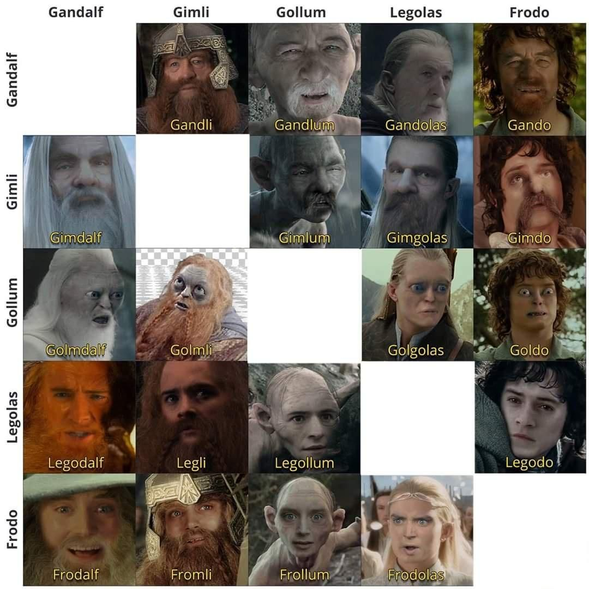

# GANDalf: One Shot Face Tolkeinization now with Diffusers!

Version 2.0 of GANdalf, switching to stable diffusion as the back end for image generation.

Features:
- Much better beard and hair generation.
- Improved debearding and baldification
- Higher resolution output imagery.
- No more fine tuning!
- More computationally expensive 🚀

# GANdalf: One Shot Face Tolkeinization
Currently non existent code for the currently theoretical paper "GANdalf: One Shot Face Tolkienization" 

## It began, with the forging of the great memes

I once saw a hilarious image from reddit where somebody had made a matrix of a few different Lord of the Rings characters, combining their appearances and names.

I want to replicate this, but with AI.
